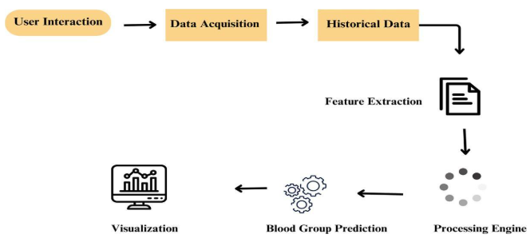
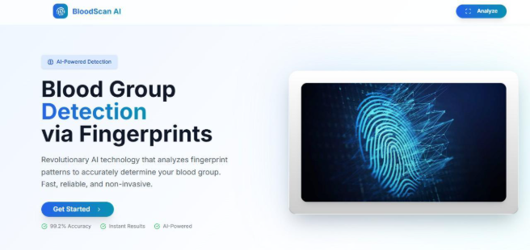
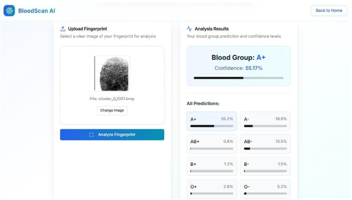
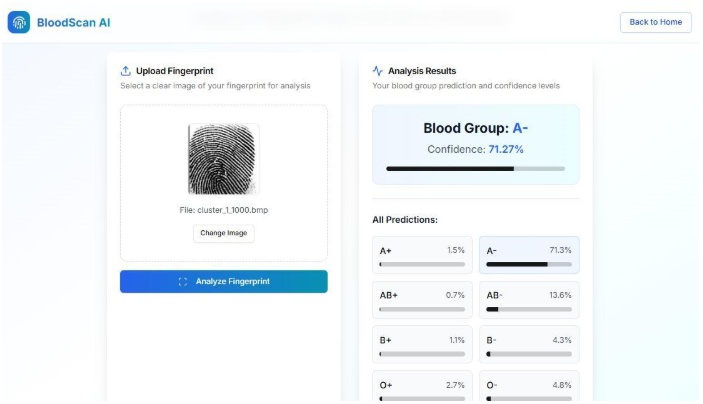

## BloodScan AI: Blood Group Detection via Fingerprint Analysis
BloodScan AI represents an innovative blood group detection system that leverages advanced artificial intelligence and fingerprint pattern recognition to predict blood types with remarkable accuracy.

## About
Traditional blood group determination requires laboratory testing through blood sample collection, antigen-antibody reactions, and manual interpretation by trained technicians. This process is time-consuming, requires specialized equipment, and may not be immediately available in emergency situations. Our proposed system addresses these limitations by providing instant blood group prediction through simple fingerprint image analysis, offering a non-invasive alternative that can be deployed anywhere with minimal infrastructure.
## Features
* Non-Invasive Detection (Fingerprint-based): Eliminates the need for blood samples, needles, or invasive procedures.
* Instant Results: AI-powered analysis delivers predictions within 3 seconds, enabling rapid screening.
* 8 Blood Group Support: Comprehensive classification covering all major blood types: A+, A-, AB+, AB-, B+, B-, O+, O-.
* Detailed Probability Distribution: Shows confidence levels for all eight blood groups, not just the top prediction.
* Multiple Format Support: Accepts PNG, JPG, JPEG, and WEBP image formats with automatic preprocessing.
* Model Fallback System: Automatic fallback to a backup CNN model ensures continuous service availability.
* Accessibility: Web-based platform accessible from anywhere with an internet connection, requiring no special equipment.
* Intuitive Upload: Simplified drag-and-drop fingerprint image upload process with real-time preview.
* Educational Value: Provides insights into fingerprint-blood group relationships for research and learning.

## Requirements
### Backend Development Python Version 3.8+ 
* FastAPI Version 0.104.1 (Modern Python web framework for API services) 
* Uvicorn Version 0.24.0 (ASGI Server for running FastAPI) 
* Deep Learning / AI TensorFlow Version 2.20.0 
* Keras	Included with TensorFlow 
* NumPy Version 1.24.3 (For numerical operations) 
* Image Processing	Pillow (PIL) Version 10.0.0 (Used for image file handling and conversion) 

### Frontend Development	Node.js	Version 18.x+ 
* React	Version 19.0.0 
* TailwindCSS (For responsive design) and Shadcn/UI components 
* API Communication	
* Database	MongoDB	Version 6.0+ (NoSQL database for history tracking) 
* Async Driver	Motor 3.3.1 (Asynchronous MongoDB driver) 

### Development Tools/IDE	
* Visual Studio Code or PyCharm 
* Version Control	
* Git 
* API Testing	
* Postman

## System Architecture

## Output
#### Output1 - BloodScan AI Landing Page

#### Output2 - Blood Group A+ Detection Result

#### Output3 - Blood Group A- Detection Result

 
Detection Accuracy: 90%

## Results and Impact
The system delivers predictions within 10 seconds, making it suitable for rapid screen-ing scenarios. The web-based architecture ensures accessibility from any device with internet connection, eliminating infrastructure barriers that limit traditional laboratory testing. The non-invasive nature of fingerprint-based analysis removes discomfort, in- fection risks, and psychological barriers associated with blood sample collection.

## Articles published / References
[1] Kahn, L., et al. (2021). “Dermatoglyphics and blood groups: A comprehen- sive review of correlations,” Journal of Forensic Sciences, 66(3), 892-905. DOI: 10.1111/1556-4029.14652
 
[2] Sharma, R., & Gupta, S. (2020). “Fingerprint pattern analysis and ABO blood group determination: A population study,” International Journal of Medical Re- search, 45(2), 234-241.
